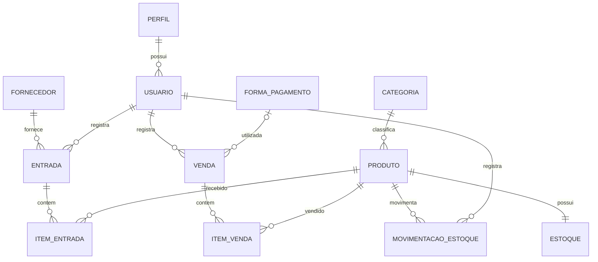

# Modelagem Conceitual

## Objetivo

Identificar as principais entidades do sistema **Gestão Comercial SQL** e representar os relacionamentos existentes entre elas.

A modelagem contempla os cadastros, as operações comerciais e o histórico de movimentações do Minimercado Domingues.

## Entidades

### Perfil

Representa o nível de acesso atribuído a um usuário.

Perfis iniciais:

* Administrador
* Estoquista
* Caixa

Um perfil pode ser atribuído a vários usuários.

### Usuário

Representa uma pessoa autorizada a utilizar o sistema.

Cada usuário possui um perfil e pode ser responsável por:

* entradas de mercadorias;
* vendas;
* movimentações de estoque.

A autenticação e a aplicação das permissões serão implementadas posteriormente na API.

### Categoria

Organiza os produtos por tipo.

Categorias iniciais:

* Alimentos
* Bebidas
* Higiene
* Limpeza

Uma categoria pode classificar vários produtos.

### Produto

Representa um item comercializado pelo Minimercado Domingues.

Cada produto pertence a uma categoria e possui informações como:

* nome;
* código de barras;
* preço de custo;
* preço de venda;
* estoque mínimo;
* situação de atividade.

Um produto pode participar de entradas, vendas e movimentações de estoque.

### Estoque

Armazena a quantidade atualmente disponível de um produto.

Cada produto possui somente um registro de estoque, atualizado pelas operações de entrada e venda.

### Fornecedor

Representa uma empresa responsável pelo fornecimento de mercadorias.

Um fornecedor pode estar associado a várias entradas de mercadorias.

### Entrada

Representa o recebimento de mercadorias de um fornecedor.

Cada entrada:

* pertence a um fornecedor;
* é registrada por um usuário;
* pode possuir vários itens;
* possui data, status e valor total.

Uma entrada aberta pode permanecer temporariamente sem itens, mas somente pode ser confirmada quando possuir pelo menos um item.

### Item da entrada

Representa um produto incluído em uma entrada de mercadorias.

O item registra:

* produto;
* quantidade;
* custo unitário;
* subtotal.

O mesmo produto não pode aparecer mais de uma vez na mesma entrada.

### Venda

Representa uma operação de venda realizada no minimercado.

Cada venda:

* é registrada por um usuário;
* pode possuir uma forma de pagamento;
* pode conter vários itens;
* possui data, status e valor total.

Uma venda aberta pode permanecer temporariamente sem itens, mas somente pode ser concluída quando possuir pelo menos um item e estoque suficiente.

### Item da venda

Representa um produto incluído em uma venda.

O item registra:

* produto;
* quantidade;
* preço unitário;
* subtotal.

O preço unitário preserva o valor praticado no momento da venda. O mesmo produto não pode aparecer mais de uma vez na mesma venda.

### Forma de pagamento

Representa a forma utilizada para pagamento de uma venda.

Formas iniciais:

* Dinheiro
* Pix
* Cartão de débito
* Cartão de crédito

Uma forma de pagamento pode ser utilizada em várias vendas.

### Movimentação de estoque

Registra uma alteração na quantidade disponível de um produto.

A movimentação armazena:

* produto;
* usuário responsável;
* tipo;
* quantidade;
* data;
* tipo da origem;
* identificador da origem;
* observação.

Tipos previstos:

* Entrada
* Saída
* Devolução
* Ajuste

Os campos de origem permitem relacionar logicamente uma movimentação à entrada ou à venda que a gerou.

## Relacionamentos

| Origem             | Relacionamento                         | Destino                  |
| ------------------ | -------------------------------------- | ------------------------ |
| Perfil             | Um perfil pode possuir vários          | Usuários                 |
| Categoria          | Uma categoria pode classificar vários  | Produtos                 |
| Produto            | Um produto possui um único             | Estoque                  |
| Fornecedor         | Um fornecedor pode possuir várias      | Entradas                 |
| Usuário            | Um usuário pode registrar várias       | Entradas                 |
| Entrada            | Uma entrada pode possuir vários        | Itens de entrada         |
| Produto            | Um produto pode aparecer em vários     | Itens de entrada         |
| Usuário            | Um usuário pode registrar várias       | Vendas                   |
| Forma de pagamento | Uma forma pode ser utilizada em várias | Vendas                   |
| Venda              | Uma venda pode possuir vários          | Itens de venda           |
| Produto            | Um produto pode aparecer em vários     | Itens de venda           |
| Produto            | Um produto pode possuir várias         | Movimentações de estoque |
| Usuário            | Um usuário pode registrar várias       | Movimentações de estoque |

## Cardinalidades importantes

* Cada usuário pertence a exatamente um perfil.
* Cada produto pertence a exatamente uma categoria.
* Cada produto possui exatamente um registro de estoque.
* Cada entrada pertence a exatamente um fornecedor.
* Cada entrada é registrada por exatamente um usuário.
* Cada item de entrada pertence a exatamente uma entrada e um produto.
* Cada venda é registrada por exatamente um usuário.
* A forma de pagamento pode permanecer ausente enquanto a venda estiver aberta.
* Cada item de venda pertence a exatamente uma venda e um produto.
* Cada movimentação pertence a exatamente um produto e um usuário.
* Entradas e vendas abertas podem permanecer temporariamente sem itens.
* Entradas confirmadas e vendas concluídas devem possuir pelo menos um item.

## Diagrama conceitual

## Observação sobre as movimentações

A origem de uma movimentação é armazenada por meio dos campos `OrigemTipo` e `OrigemID`.

Essa associação é lógica porque uma movimentação pode ter diferentes origens, como:

* uma entrada de mercadorias;
* uma venda;
* uma devolução;
* um ajuste manual.

Por esse motivo, não existe uma chave estrangeira única entre `MovimentacoesEstoque` e todas as possíveis tabelas de origem.
